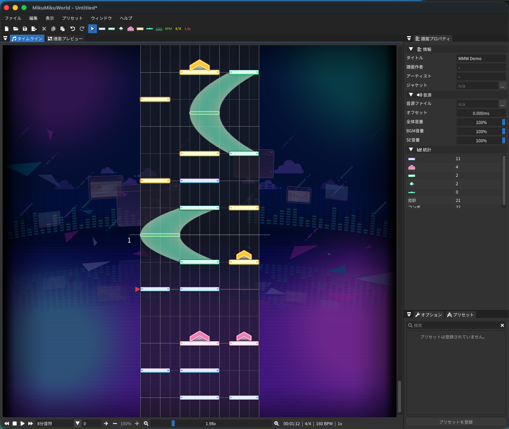

**English** / [日本語](./README.ja.md)

# MikuMikuWorld
A chart editor and viewer for the mobile rhythm game Project Sekai Colorful Stage feat. Hatsune Miku.

## Features:
- Import and export Sliding Universal Score (\*.sus) files.
- BPM, time signature, and hi-speed adjustment.
- Custom timeline divisions up to 1920.
- Create and use custom note presets.
- Customizable keyboard shortcuts.

## Requirements:
- macOS 10.14 or later.
- GPU supporting OpenGL 3.3.

> This fork is macOS-only. Windows support was dropped during the Cocoa port.

## Build from source:
```bash
cmake -S . -B build
cmake --build build
open build/MikuMikuWorld.app
```
Requires CMake 3.21+ and Xcode command-line tools. GLFW and zlib are fetched automatically via `FetchContent`.

User data (config, layout, presets, auto-saves) is stored under `~/Library/Application Support/MikuMikuWorld/`.

## Screenshot:

